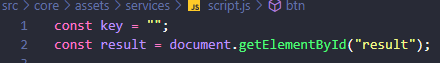

## What's WeatherApp Project?

Getting informations on [Open Weather API](https://openweathermap.org/api) you can see how is the temperature, humidity and description sky from any city
around the world in real time. You just type the city and click on the button 🔍


## How to use this

The first step to use the WeatherApp is clone the repository:
```
$git clone https://github.com/marcos-jacometti/WeatherApp.git
```

Then, you have to install the npm:
```
$npm install
```

After this, go to the [Open Weather API](https://openweathermap.org/api) to get your api key, you have to do the sign up if you haven't an account.

With your api key on hands, go to src/core/assets/services/script.js and update the const key = "your key here";



It's done! Now, just start your project...
```
$npm start
```

## Technologies

- React.JS
- React Icons
- Styled-components
- Rest API 
- JavaScript

## Contact me

Email: marcosjacometti10@gmail.com
LinkedIn: [Marcos Jacometti](https://www.linkedin.com/in/marcos-vin%C3%ADcius-jacometti-675202202/)

Thank you guys, enjoy the code! ☕